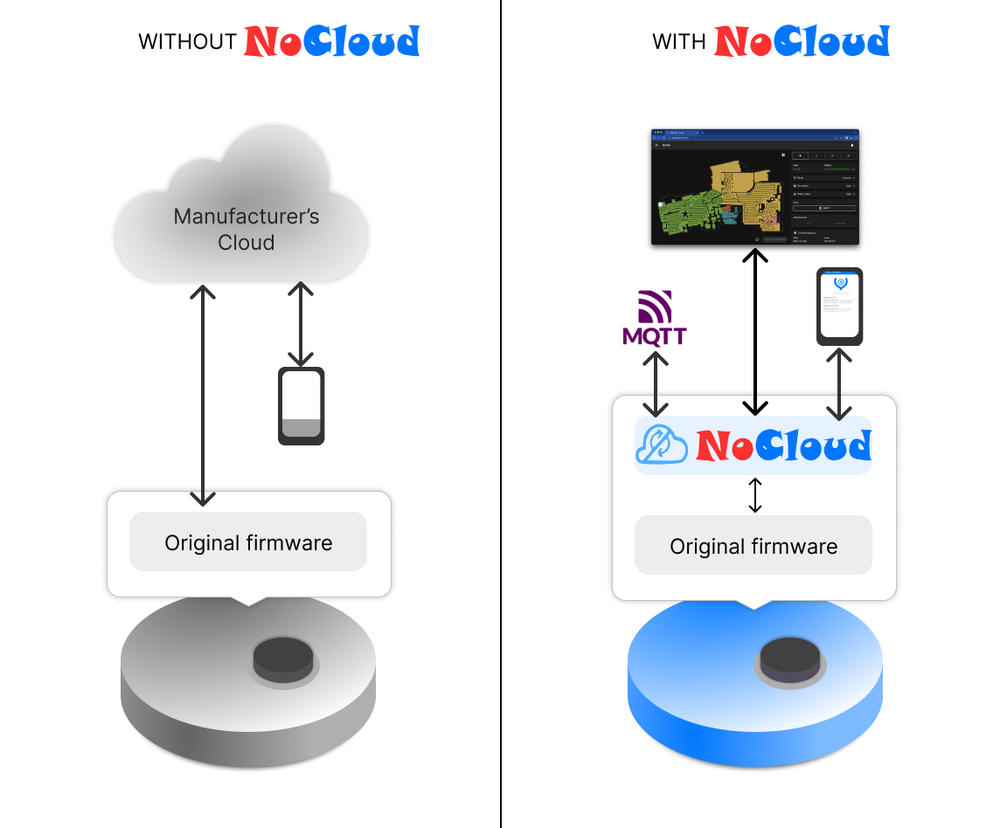

# NoCloud Newcomer Guide

Hi and welcome to the NoCloud Newcomer Guide.

This should hopefully answer all the questions you might have and also be interesting to read for people that haven't been following the recent development.

_Last update: 2024-06-18_

## What is NoCloud?

NoCloud is a cloud replacement for vacuum robots enabling local-only operation. It is not a custom firmware. 
Here's a diagram illustrating the core operation principle:

Because NoCloud is not a custom firmware, it cannot change anything about how the robot operates. 
What it can do however is protecting your data and enable you to connect your robot
to your home automation system without having to detour through a vendor cloud, which,
apart from the whole data problematic, might not be reachable due to your internet connection
being down or some servers in the datacenter being on fire.

Not having to leave your local network of course also benefits the latency of commands, status reports etc.

NoCloud aims to be proof that easy to use and reliable smart appliances are possible without any cloud and/or account requirements.
Maybe at some point it might help convince vendors that there is another way of doing things.

If you want to learn more about why someone would want to use something like NoCloud, check out the [Why NoCloud?](https://Valetudo.Cloud/pages/general/why-NoCloud.html) page.

If you want to learn more about why someone would **not** want to use something like NoCloud, check out the [Why not NoCloud?](https://Valetudo.Cloud/pages/general/why-not-NoCloud.html) page.

## Who is NoCloud for?

NoCloud can be used by anyone with a basic understanding of the english language.

**Note:** 
While NoCloud can be **used** by anyone with a basic understanding of the english language, it cannot be **installed**
just with those skills.

To install NoCloud you will need some understanding of linux-ish operating systems as well as computers in general
and maybe even some basic hardware hacking stuff.
If you lack these skills, please consider asking a friend or computer repair shop to help you with that.

As NoCloud is just the hobby project of some guy on the internet, it is not possible (nor intended) for it to provide
first-level/tier-one support.

## What can NoCloud do?

By default, NoCloud provides control over your vacuum robot via a **responsive webinterface** that works on all of your devices.
It can be used on phones, tablets as well as your desktop computer.

Furthermore, there's a **REST-interface** documented with **Swagger UI** as well as **MQTT**.
With support for both **Homie** and **Home Assistant Autodiscovery** for MQTT, you're able to connect NoCloud to
the open-source smarthome software of your choice.

Make sure to check out the [MQTT Docs](https://Valetudo.Cloud/pages/integrations/mqtt.html) as well as the
[OpenHAB integration](https://Valetudo.Cloud/pages/integrations/openhab-integration.html).

NoCloud fully supports:

- Room Cleaning, splitting, merging and renaming
- Water Pump controls and editing no-mop zones
- Editing Virtual Walls, No-Go Areas
- Dynamic zoned cleanup
- Go-To locations
- Start/Stop/Home/Locate and Fan speed control
- Consumables monitoring
- Carpet mode and persistent data control
- Audio volume control

as long as your robots firmware can actually do that.

By replacing the cloud, you also gain access to your own data, which you can use however you like.

For example there are already a few applications that turn your map data into various other formats such as [Minecraft Worlds
or Source-Engine maps](https://Valetudo.Cloud/pages/companion_apps/fun_games.html). There's a huge amount of possibilities yet to be explored.

Due to the openly documented, standardized and easily accessible Map Data, one can use any NoCloud-compatible Vacuum Robot to map out
a new home, write some glue code to transform it into the 3d software of their choice and use that precise floor plan to
figure out where to put the furniture.

Furthermore, the standardised NoCloud API allows for the creation of companion services such as [Valeronoi](https://github.com/ccoors/Valeronoi),
which can build a Wi-Fi signal heatmap from the data provided by NoCloud.

## Which robot should I buy to use it with NoCloud?

To choose the right robot to buy, head over to [Buying supported robots](https://Valetudo.Cloud/pages/general/buying-supported-robots.html).

If you want to use NoCloud, please buy a supported robot.

Please refrain from buying any random robot just to then ask how we can make NoCloud on that thing happen. 
Unless there are very good reasons to support a new Model/Brand/etc. such as
- amazing new features. which provide something that isn't available on anything else currently supported
- older supported models becoming EOL and getting hard to buy

it likely won't happen as chosen the strategy is to stick to a few well-supported and actually good models.

## How do I install NoCloud?

The [getting started guide](https://Valetudo.Cloud/pages/general/getting-started.html) is a good place to start.

## Where can I get support?

If you're looking for answers/support, the first place to look are the docs.

Furthermore, you can also check the <a href="https://t.me/+F00lFE1NVUc2NTAy" data-si="34097f03527c7c0375540b07132a652161373b400c1039757e5c7a5e63536401556c2b1a2c41227d">Valetudo Telegram group</a>.
Telegram features a very powerful full-text search so make sure to use that before asking.

There's also the option of using the [GitHub Discussions feature](https://github.com/DGAlexandru/NoCloud/discussions/categories/q-a-support).
The same "search before you ask" applies here.
If you experience issues, please don't immediately file a bug report but instead only do that if you're 100% sure that it is actually a bug.

In general and especially if you're new to open source, It's strongly recommended to thoroughly read and understand
"[How To Ask Questions The Smart Way](http://www.catb.org/~esr/faqs/smart-questions)", since that will make interactions much better for everyone involved.

## How can I contribute to NoCloud?

Generally speaking, the best way to contribute to NoCloud is to support other NoCloud users.

For anything beyond that, make sure to familiarize yourself with the [CONTRIBUTING.md](https://github.com/DGAlexandru/NoCloud/blob/main/CONTRIBUTING.md)
